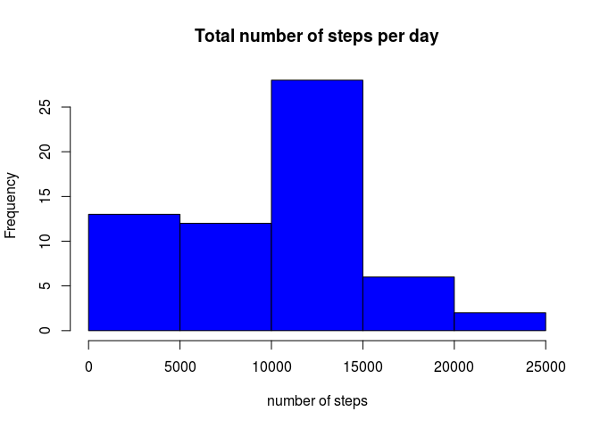
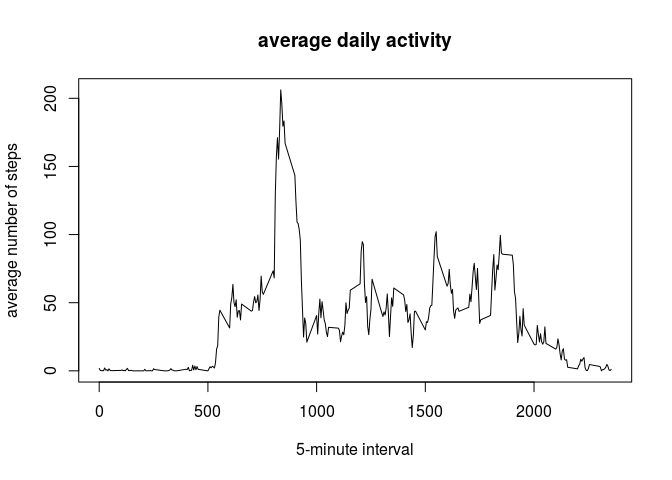
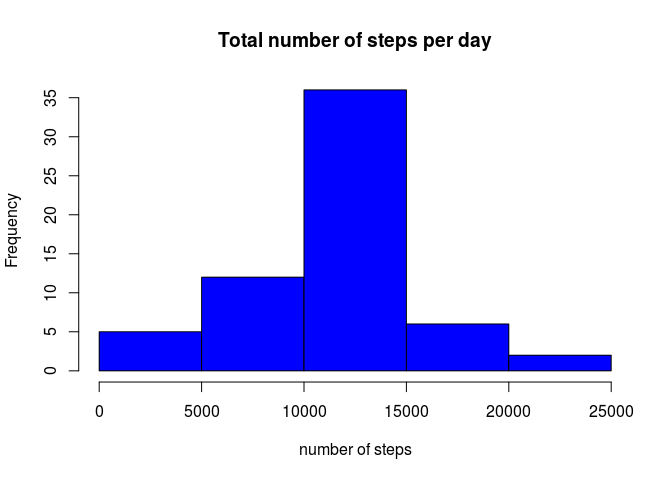
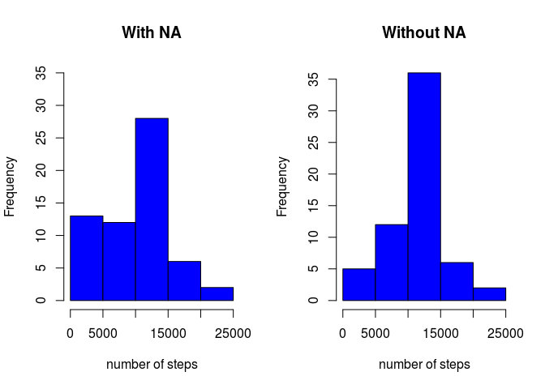
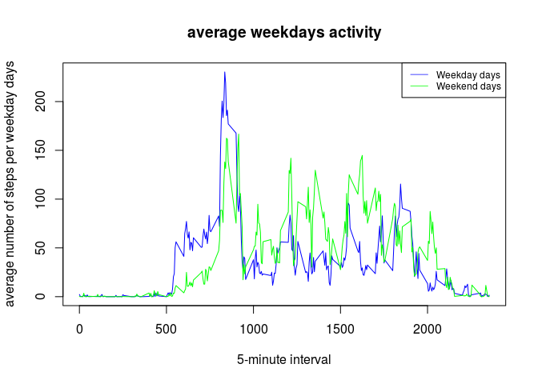

# Reproducible Research: Peer Assessment 1


## Loading and preprocessing the data


```r
fileUrl <- "https://d396qusza40orc.cloudfront.net/repdata%2Fdata%2Factivity.zip"
if (!file.exists("activity.csv")) {
  download.file(fileUrl, destfile="activity.zip", method="curl")
  unzip("activity.zip")
}
data <- read.csv("activity.csv")
```


## What is mean total number of steps taken per day?


1. Calculate the total number of steps taken per day  

We will use the dplyr librarie : `library(dplyr)`  
We calculate the total of steps after grouping by day

```
## 
## Attaching package: 'dplyr'
## 
## The following object is masked from 'package:stats':
## 
##     filter
## 
## The following objects are masked from 'package:base':
## 
##     intersect, setdiff, setequal, union
```


```r
per_day <- group_by(data, date)
step_per_day <- summarise(per_day, total_step = sum(steps, na.rm = TRUE))
step_per_day
```

```
## Source: local data frame [61 x 2]
## 
##          date total_step
## 1  2012-10-01          0
## 2  2012-10-02        126
## 3  2012-10-03      11352
## 4  2012-10-04      12116
## 5  2012-10-05      13294
## 6  2012-10-06      15420
## 7  2012-10-07      11015
## 8  2012-10-08          0
## 9  2012-10-09      12811
## 10 2012-10-10       9900
## ..        ...        ...
```


2. Make a histogram of the total number of steps taken each day  


```r
hist(step_per_day$total_step, col = "blue", main = "Total number of steps per day",
     xlab = "number of steps")
```

 


3. Calculate and report the mean and median of the total number of steps taken per day  


```r
mean_steps_per_day <- mean(step_per_day$total_step, na.rm = TRUE)
mean_steps_per_day
```

```
## [1] 9354.23
```

```r
median_steps_per_day <- median(step_per_day$total_step, na.rm = TRUE)
median_steps_per_day
```

```
## [1] 10395
```


## What is the average daily activity pattern?  

1. Make a time series plot (i.e. type = "l") of the 5-minute interval (x-axis)
and the average number of steps taken, averaged across all days (y-axis)  


```r
interval_per_day <- summarise(group_by(per_day, interval), 
                              avg_steps = mean(steps, na.rm = TRUE))

plot(interval_per_day$interval, interval_per_day$avg_steps, type = "l",
     main = "average daily activity", xlab = "5-minute interval",
     ylab = "average number of steps")
```

 

2. Which 5-minute interval, on average across all 
the days in the dataset, contains the maximum number of steps?  


```r
max_steps <- filter(interval_per_day, avg_steps == max(interval_per_day$avg_steps, na.rm = TRUE) )
max_steps$interval
```

```
## [1] 835
```


## Imputing missing values  

1- Calculate and report the total number of missing values in the dataset 
(i.e. the total number of rows with NAs)  


```r
total_NA <- length(data[is.na(data)])
total_NA
```

```
## [1] 2304
```

2- trategy for filling in all of the missing values in the dataset. 
The strategy does not need to be sophisticated. For example, you could use 
the mean/median for that day, or the mean for that 5-minute interval, etc.

I replace the missing values with the mean corresponding to the interval per day  

3- Create a new dataset that is equal to the original dataset but with the missing data filled in.  


```r
filled_data <- data %>%
  group_by(interval) %>%
  mutate(steps = replace(steps, is.na(steps), mean(steps, na.rm=TRUE)))
head(filled_data)
```

```
## Source: local data frame [6 x 3]
## Groups: interval
## 
##       steps       date interval
## 1 1.7169811 2012-10-01        0
## 2 0.3396226 2012-10-01        5
## 3 0.1320755 2012-10-01       10
## 4 0.1509434 2012-10-01       15
## 5 0.0754717 2012-10-01       20
## 6 2.0943396 2012-10-01       25
```

4- Make a histogram of the total number of steps taken each day and Calculate and report the mean and median total number of steps taken per day. Do these values differ from the estimates from the first part of the assignment? What is the impact of imputing missing data on the estimates of the total daily number of steps?

The new histogram :

```r
filled_per_day <- group_by(filled_data, date)
filled_step_per_day <- summarise(filled_per_day, total_step = sum(steps))
hist(filled_step_per_day$total_step, col = "blue", main = "Total number of steps per day",
     xlab = "number of steps")
```

 

Calculate and report the mean and median of the total number of steps taken per day : 


```r
mean_filled_steps_per_day <- mean(filled_step_per_day$total_step, na.rm = TRUE)
mean_filled_steps_per_day
```

```
## [1] 10766.19
```

```r
median_filled_steps_per_day <- median(filled_step_per_day$total_step, na.rm = TRUE)
median_filled_steps_per_day
```

```
## [1] 10766.19
```

As we can see below, the values differ from the estimates from the first part of the assignment. The total daily number of steps is increasing with imputing missing values :  


```r
par(mfrow = c(1, 2))
hist(step_per_day$total_step, col = "blue", main = "With NA",
     xlab = "number of steps", ylim = c(0,35))
hist(filled_step_per_day$total_step, col = "blue", main = "Without NA",
     xlab = "number of steps")
```

 


## Are there differences in activity patterns between weekdays and weekends?

1- Create a new factor variable in the dataset with two levels – “weekday” 
and “weekend” indicating whether a given date is a weekday or weekend day.


```r
filled_data["weekday"] <- weekdays(as.Date(filled_data$date))

filled_data <- filled_data %>%
  mutate(weekday = replace(weekday, weekday == "sábado" | weekday == "domingo", "weekend"))
         
filled_data <- filled_data %>%
  mutate(weekday = replace(weekday, weekday != "weekend", "weekday"))
```

2- Make a panel plot containing a time series plot (i.e. type = "l") of the 5-minute interval (x-axis) and the average number of steps taken, averaged across all weekday days or weekend days (y-axis)  


```r
interval_per_weekday_end <- group_by(filled_data, weekday, interval)
interval_per_weekday <- filter(interval_per_weekday_end, weekday == "weekday")
interval_per_weekday <- summarise(interval_per_weekday, avg_steps_weekdays = mean(steps, na.rm = TRUE))

interval_per_weekend <- filter(interval_per_weekday_end, weekday == "weekend")
interval_per_weekend <- summarise(interval_per_weekend, avg_steps_weekend = mean(steps, na.rm = TRUE))

plot(interval_per_weekday$interval, interval_per_weekday$avg_steps_weekdays, type = "l",
      main = "average weekdays activity",
      xlab = "5-minute interval",
     ylab = "average number of steps per weekday days", col = "blue")
lines(interval_per_weekend$interval, interval_per_weekend$avg_steps_weekend, type = "l",
      col = "green")
legend("topright", 
       legend = c("Weekday days", 
                  "Weekend days"), 
       col = c("blue", "green"), 
       lwd = .75, 
       cex = .75
)
```

 


